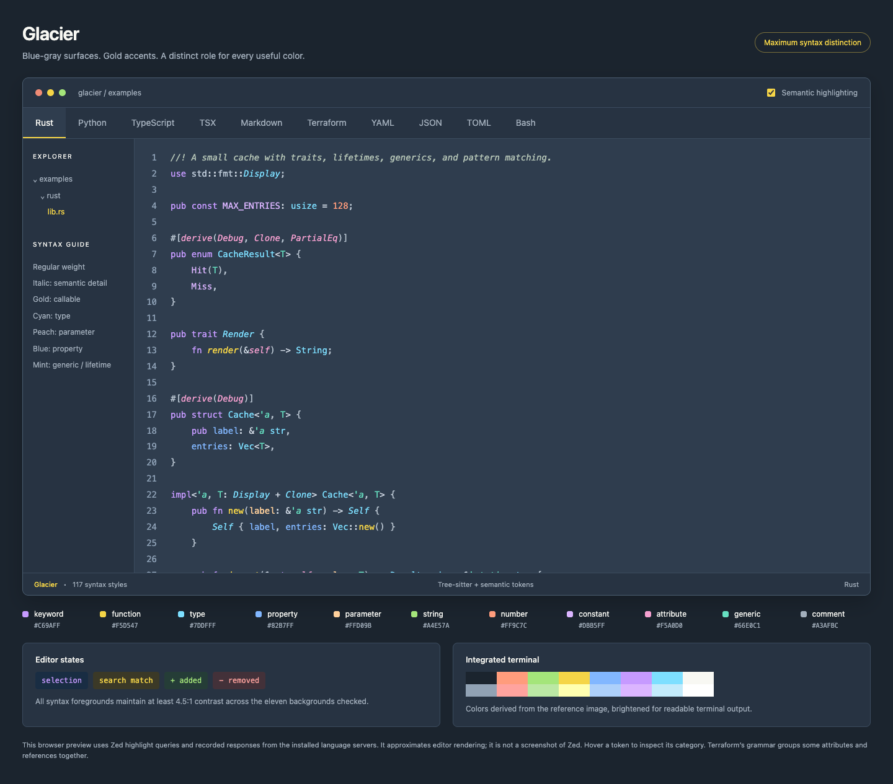

# Glacier

A dark Zed theme with a blue-gray editor, vibrant accents, and detailed syntax colors for Rust, Python, TypeScript, and TSX. All syntax uses regular font weight, with selective italics for additional distinctions.



Download or clone the repository and open [the interactive preview](previews/index.html) locally to compare ten languages and toggle semantic highlighting. [Rust](previews/rust.png), [Python](previews/python.png), [TypeScript](previews/typescript.png), [TSX](previews/tsx.png), and [Terraform](previews/terraform.png) screenshots are included. These are browser renderings of actual syntax captures and recorded language-server tokens, not screenshots of Zed.

## Install

Clone this repository and use **Install Dev Extension** from Zed’s Extensions page, selecting the repository directory. Alternatively, copy `themes/glacier.json` to `~/.config/zed/themes/` on macOS/Linux, or `%APPDATA%\\Zed\\themes\\` on Windows. Select **Glacier** with Zed’s theme selector (`Cmd-K`, `Cmd-T` on macOS).

For the full syntax treatment, merge `settings/semantic-highlighting.json` into your Zed user settings. Merge the entries into existing `languages` and `global_lsp_settings` objects rather than replacing unrelated preferences. This enables `combined` semantic highlighting for Rust, Python, TypeScript, and TSX and supplies the additional token rules. Restart the affected language servers if their highlighting does not update immediately.

The theme extension supplies colors only. The companion settings are optional and are not applied automatically. Switching themes leaves those semantic settings enabled; remove or restore the entries you added to undo that configuration.

## Visual language

| Role | Color | Detail |
| --- | --- | --- |
| Background | `#2F3D4E` | Blue-gray |
| Keywords | `#C69AFF` | Vibrant lavender |
| Functions | `#F5D547` | Gold; methods italic |
| Types | `#7DDFFF` | Cyan; interfaces and traits italic |
| Properties | `#82B7FF` | Blue; readonly members italic |
| Parameters | `#FFD09B` | Peach; mutable parameters italic |
| Strings | `#A4E57A` | Green; escapes and interpolation distinct |
| Numbers | `#FF9C7C` | Coral; also used for unsafe constructs |
| Constants / variants | `#DBB5FF` | Pale violet; booleans use `#F6B4FF` |
| Macros / decorators | `#F5A0D0` | Rose; decorators italic |
| Generics / lifetimes | `#66E0C1` | Mint; lifetimes italic |
| Comments | `#A3AFBC` | Doc comments use a separate gray-green |

The theme includes 117 syntax styles, 33 semantic rules, normal/bright/dim ANSI colors, collaboration cursor colors, and explicit editor, search, diff, completion-surface, focus, and diagnostic colors. All syntax uses regular font weight. Local variables remain white; mutable Rust bindings become italic. Deprecated semantic tokens receive a strikethrough. Markdown strong emphasis is gold without bold weight.

All syntax foregrounds meet a 4.5:1 contrast target on eleven checked backgrounds, including selections and diff highlights. This measurement does not imply every pair of token colors is equally distinguishable or certify the entire editor interface for accessibility.

## Coverage and limits

See [the coverage notes](validation/COVERAGE.md) and [machine-readable checks](validation/report.json).

- Rust, Python, TypeScript, and TSX were checked against real responses from the locally installed language servers, including parameter/field differences and Rust enum variants and mutability.
- Markdown, Terraform/HCL, YAML, JSON, TOML, and Bash have parsed preview fixtures. Dockerfile and SQL have sample files and audited capture coverage.
- Terraform, TOML, Dockerfile, and SQL need the corresponding language extensions. A color theme does not install grammars or language servers.
- Semantic rules reference theme style names rather than hardcoded colors. They are global settings and remain active when changing themes; their appearance in other themes depends on those themes’ styles.
- Fine distinctions depend on the server and its current project knowledge. The preview renderer does not reproduce all of Zed’s nesting, injections, font metrics, or UI behavior.

## Develop

`scripts/build.py` is the source of truth. It generates the theme, semantic companion, and palette using only the Python standard library:

```sh
python3 scripts/build.py
```

Portable packaging checks need Python 3.11+ and `jsonschema`:

```sh
python3 -m pip install jsonschema==4.26.0
python3 scripts/check_package.py
```

The GitHub Actions workflow runs these checks and verifies that generated files are current. See [PUBLISHING.md](PUBLISHING.md) for the separate Zed registry submission process.

To regenerate validation and previews on macOS with Zed’s language servers and extensions installed:

```sh
python3 -m venv .venv
.venv/bin/pip install -r requirements-dev.txt
.venv/bin/python scripts/prepare_validation.py
.venv/bin/python scripts/inspect_tokens.py rust
.venv/bin/python scripts/inspect_tokens.py python
.venv/bin/python scripts/inspect_tokens.py typescript
.venv/bin/python scripts/validate.py
.venv/bin/python scripts/preview.py --screenshots
```

Screenshots use installed Google Chrome in an isolated headless profile. Opening `previews/index.html` needs no server or external assets. Hover code tokens to see their categories; use the language tabs or arrow keys to move between samples.

Zed references are pinned in `scripts/prepare_validation.py`; supporting extension queries come from the local installation. The hosted theme schema is retained in `validation/theme-schema.json` for reproducible checks. Several current Zed color fields are newer than that schema, so validation also checks an explicit allowlist against the inspected Zed source.

Sources: [Zed themes](https://zed.dev/docs/themes), [syntax captures](https://zed.dev/docs/extensions/languages#syntax-highlighting), [semantic tokens](https://zed.dev/docs/semantic-tokens), and [the upstream Zed source](https://github.com/zed-industries/zed/tree/e91b82c106817f2419207ebf81f1da766698ac95).

## License

[MIT](LICENSE). The validation schema is sourced from Zed’s published theme schema; downloaded upstream query files are development references and are not included in the extension.
